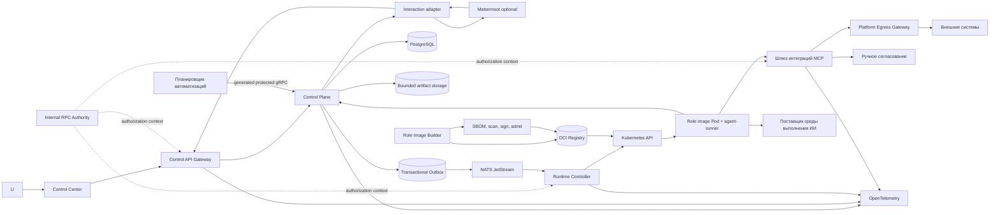

# Высокоуровневая архитектура

## Control Plane

Хранит желаемое состояние и бизнес-модель: организации, рабочие области, агенты, поставщики моделей, интеграции, инструкции, управляемые процессы, расписания, сессии, метаданные файлов, согласования и аудит.

Control Plane не публикует внешний HTTP API и не создает pod Kubernetes
напрямую. Он фиксирует business state, idempotency receipt, audit и обязательные
events одной PostgreSQL-транзакцией.

## Control API Gateway

Предоставляет owner-facing OpenAPI и WebSocket API для Control Center,
аутентифицирует пользователя и преобразует запросы в generated gRPC clients.
Gateway не читает PostgreSQL Control Plane напрямую.

## Interaction adapters

Обрабатывают входящие сообщения и исходящие delivery attempts подключаемых
каналов. Они не владеют сессиями, Run, Human Gates, artifacts либо terminal
outcome. Полностью отключённый Mattermost не влияет на startup и readiness
web-only профиля.

## Контроллер среды выполнения

Сопоставляет желаемое состояние среды выполнения с ресурсами Kubernetes. Сверка идемпотентна и использует детерминированные имена, метки, ссылки на владельца и условия состояния.

Контроллер решает:

- какой execution-scoped pod сессии должен существовать;
- какую `RuntimeRevision` применить;
- достаточно ли ресурсов;
- какой доказанно terminal pod можно освободить;
- когда guarded удалить terminal pod, не затрагивая PVC;
- когда восстановить ход из очереди после временной ошибки.

## Цепочка образов ролей

`role-image-builder` получает fenced build attempt и собирает отдельный
promoted OCI image окружения роли через rootless BuildKit. Следующие фазы
автоматически создаёт `image-admission-controller`: `claim`, `scan`, `sign`,
`admit` и отдельную `promote`. Controller не получает credentials этих фаз;
его Kubernetes identity ограничена RBAC и fail-closed
`ValidatingAdmissionPolicy` точными Job/PVC templates. Runtime запускает агента
только из owner-selected promoted `repository@sha256`.

## Запуск агента

Компонент запуска агента управляет процессами внутри pod сессии:

- получает и подтверждает ход;
- материализует конфигурацию, авторизацию, инструкции и вложения;
- запускает адаптер среды выполнения ИИ;
- передает прогресс и потребление лимитов;
- вызывает разрешенные инструменты MCP;
- публикует итоговый результат;
- сохраняет архив сессии;
- корректно завершает дочерние процессы и обрабатывает остановку.

Компонент запуска не содержит бизнес-логику внешних каналов, создания проектов
и согласований.

## Шлюз интеграций

Предоставляет MCP endpoint в области одной сессии. Он аутентифицирует сессию агента, вычисляет права, маскирует данные, создает запросы согласования и выполняет внешние действия от имени `IntegrationConnection`.

Опасные учетные данные остаются в шлюзе или хранилище секретов и не передаются в pod агента.

## Platform Egress Gateway

Предоставляет namespace-local HTTP CONNECT Service для разрешённого
исходящего HTTPS-трафика `integration-gateway`. Он сопоставляет exact CONNECT
authority, фактический TLS ClientHello SNI и immutable policy, самостоятельно
получает bounded A/AAAA snapshot и выполняет dial только к повторно
проверенному literal IP. Gateway не завершает TLS: CA/hostname verification и
application credentials остаются end-to-end у consumer.
Один consumer proxy URL на `8080` дополнительно принимает только bodyless
`GET /readyz` без query и возвращает `204` по тому же ACTIVE/READY state;
technical `/livez`, `/readyz`, `/metrics`, `/policy` на `9090` остаются
monitoring-only.

## Internal RPC Authority

Workload-local issuer формирует короткоживущий signed authorization context
после проверки transport identity. Workload-local verifier проверяет exact RPC,
issuer, audience, actor, project, срок и replay по локальному UDS. Компонент не
становится владельцем пользователей или business permissions.

## Планировщик автоматизаций

Выбирает наступившие `AutomationSchedule`, создает уникальные экземпляры и ставит `ScheduledRun` в общую очередь. Планировщик не запускает pod напрямую и не использует Kubernetes CronJob как бизнес-модель.

## Модель согласованности

- Внутри доменного контекста используется транзакция PostgreSQL.
- Между контекстами используются transactional outbox, broker-neutral relay,
  NATS JetStream, durable PostgreSQL inbox/cursor и идемпотентные consumers.
- Синхронный путь использует Proto/gRPC с deadline, mTLS/SPIFFE и подписанным
  authorization context.
- Kubernetes, Mattermost и внешние API согласуются асинхронно с явным состоянием и повторами.
- Ручное согласование является долговечным состоянием ожидания, а не удержанием HTTP-запроса.
